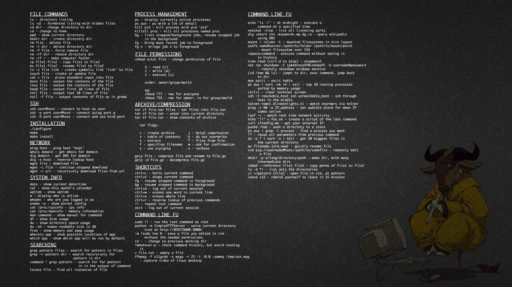

# 目录

- ./Language

- ./Language/Java

    [01_Java简介.md](./Language/Java/01_Java简介.md)

    [02_Java主要特性.md](./Language/Java/02_Java主要特性.md)

    [03_Java发展历史.md](./Language/Java/03_Java发展历史.md)

    [04_Java基本语法.md](./Language/Java/04_Java基本语法.md)

    [05_Java面向对象.md](./Language/Java/05_Java面向对象.md)

    [06_Java基本数据类型.md](./Language/Java/06_Java基本数据类型.md)

- ./Language/Python

- ./Language/Python/Django

    [Django进阶.md](./Language/Python/Django/Django进阶.md)

- ./Language/Python/Flask

    [01_Flask入门.md](./Language/Python/Flask/01_Flask入门.md)

    [02_模板引擎.md](./Language/Python/Flask/02_模板引擎.md)

    [03_flask表单.md](./Language/Python/Flask/03_flask表单.md)

    [04_文件上传及邮件发送.md](./Language/Python/Flask/04_文件上传及邮件发送.md)

    [05_数据模型Model.md](./Language/Python/Flask/05_数据模型Model.md)

    [06_Flask项目.md](./Language/Python/Flask/06_Flask项目.md)

    [07_用户管理.md](./Language/Python/Flask/07_用户管理.md)

    [08_帖子管理.md](./Language/Python/Flask/08_帖子管理.md)

    [09_Flask项目部署.md](./Language/Python/Flask/09_Flask项目部署.md)

    [RESTFul_API开发.md](./Language/Python/Flask/RESTFul_API开发.md)

- ./Language/Python/MachineLearning

    [01numpy.md](./Language/Python/MachineLearning/01numpy.md)

    [02Pandas.md](./Language/Python/MachineLearning/02Pandas.md)

    [03pandas层次化索引.md](./Language/Python/MachineLearning/03pandas层次化索引.md)

    [03Pandas的拼接操作.md](./Language/Python/MachineLearning/03Pandas的拼接操作.md)

    [04Pandas数据处理.md](./Language/Python/MachineLearning/04Pandas数据处理.md)

    [06matplotlib.md](./Language/Python/MachineLearning/06matplotlib.md)

    [07数据加载与透视表.md](./Language/Python/MachineLearning/07数据加载与透视表.md)

    [08机器学习KNN.md](./Language/Python/MachineLearning/08机器学习KNN.md)

    [09普通线性回归、岭回归、Lasso回归.md](./Language/Python/MachineLearning/09普通线性回归、岭回归、Lasso回归.md)

    [10逻辑蒂斯.md](./Language/Python/MachineLearning/10逻辑蒂斯.md)

    [IPython与Numpy.jpg](./Language/Python/MachineLearning/IPython与Numpy.jpg)

- ./Language/Python/Other

    [正则表达式.md](./Language/Python/Other/正则表达式.md)

    [Python3_Paramiko远程shell.md](./Language/Python/Other/Python3_Paramiko远程shell.md)

    [Python进阶.md](./Language/Python/Other/Python进阶.md)

    [Web基础.md](./Language/Python/Other/Web基础.md)

- ./Language/Shell

    [linux常用脚本.md](./Language/Shell/linux常用脚本.md)

    [linux_shell教程.md](./Language/Shell/linux_shell教程.md)

- ./Language/SQL

    [01-SQL简介.md](./Language/SQL/01-SQL简介.md)

    [02-SQL语法.md](./Language/SQL/02-SQL语法.md)

    [03-SQL-SELECT语句.md](./Language/SQL/03-SQL-SELECT语句.md)

    [04-SELECT-DISTINCT语句.md](./Language/SQL/04-SELECT-DISTINCT语句.md)

    [05-BETWEEN子句.md](./Language/SQL/05-BETWEEN子句.md)

    [06-AND-OR运算符.md](./Language/SQL/06-AND-OR运算符.md)

    [07-ORDER_BY关键字.md](./Language/SQL/07-ORDER_BY关键字.md)

    [08-SQL-INSERT-INTO语句.md](./Language/SQL/08-SQL-INSERT-INTO语句.md)

    [09-SQL-UPDATE语句.md](./Language/SQL/09-SQL-UPDATE语句.md)

    [10-SQL-DELETE语句.md](./Language/SQL/10-SQL-DELETE语句.md)

    [11-SQL-SELECT-TOP-LIMIT-ROWNUM子句.md](./Language/SQL/11-SQL-SELECT-TOP-LIMIT-ROWNUM子句.md)

    [深入浅出MySQL：数据库开发、优化与管理维护.第2版.pdf](./Language/SQL/深入浅出MySQL：数据库开发、优化与管理维护.第2版.pdf)

- ./Linux

- ./Linux/Centos7

    [守护进程.md](./Linux/Centos7/守护进程.md)

    [Centos7创建服务及开机启动.md](./Linux/Centos7/Centos7创建服务及开机启动.md)

    [CentOS7爬虫环境搭建.md](./Linux/Centos7/CentOS7爬虫环境搭建.md)

    [Centos7时区更改.md](./Linux/Centos7/Centos7时区更改.md)

    [CentOS7相关配置.md](./Linux/Centos7/CentOS7相关配置.md)

    [Centos7_MongoDB_install.md](./Linux/Centos7/Centos7_MongoDB_install.md)

    [Centos7selenium.md](./Linux/Centos7/Centos7selenium.md)

    [Nginx安装.md](./Linux/Centos7/Nginx安装.md)

    [RedisLive配置手册.md](./Linux/Centos7/RedisLive配置手册.md)

- ./Linux/Common

    [目录结构及VIM.md](./Linux/Common/目录结构及VIM.md)

    [认识Linux.md](./Linux/Common/认识Linux.md)

    [软件安装.md](./Linux/Common/软件安装.md)

    [文件操作.md](./Linux/Common/文件操作.md)

    [系统服务.md](./Linux/Common/系统服务.md)

    [Home目錄下中文改英文.md](./Linux/Common/Home目錄下中文改英文.md)

    [linux定时任务.md](./Linux/Common/linux定时任务.md)

    [linux开机启动任务.md](./Linux/Common/linux开机启动任务.md)

    [Linux.md](./Linux/Common/Linux.md)

    [SpaceVIM.md](./Linux/Common/SpaceVIM.md)

- ./Linux/Deepin

    [deepin_TouchPad_setting.md](./Linux/Deepin/deepin_TouchPad_setting.md)

- ./Linux/Manjaro

    [Manjaro初始配置.md](./Linux/Manjaro/Manjaro初始配置.md)

    [manjaroKDE安装配置.md](./Linux/Manjaro/manjaroKDE安装配置.md)

    [Manjaro-pacman命令.md](./Linux/Manjaro/Manjaro-pacman命令.md)

- ./Linux/Other

    [mongodb_data_migration.md](./Linux/Other/mongodb_data_migration.md)

    [pycharm-pro.md](./Linux/Other/pycharm-pro.md)

- ./Linux/Ubuntu

    [apt_info.md](./Linux/Ubuntu/apt_info.md)

    [dpkg.md](./Linux/Ubuntu/dpkg.md)

    [GoogleChromeinstall.md](./Linux/Ubuntu/GoogleChromeinstall.md)

    [MongoDB_install.md](./Linux/Ubuntu/MongoDB_install.md)

    [pyenv_install.md](./Linux/Ubuntu/pyenv_install.md)

    [Sdkman.md](./Linux/Ubuntu/Sdkman.md)

    [SublimeTest3Install.md](./Linux/Ubuntu/SublimeTest3Install.md)

    [Ubuntu安装oh_my_zsh.md](./Linux/Ubuntu/Ubuntu安装oh_my_zsh.md)

    [ubuntu备份还原.md](./Linux/Ubuntu/ubuntu备份还原.md)

    [ubuntu_apt_source.md](./Linux/Ubuntu/ubuntu_apt_source.md)

    [ubuntu_deepinwine_software.md](./Linux/Ubuntu/ubuntu_deepinwine_software.md)

    [ubuntu_java开发环境搭建.md](./Linux/Ubuntu/ubuntu_java开发环境搭建.md)

    [ubuntu_python3_tk_error.md](./Linux/Ubuntu/ubuntu_python3_tk_error.md)

    [ubuntu_sougouInput_install.md](./Linux/Ubuntu/ubuntu_sougouInput_install.md)

    [ubuntu_Typora安装.md](./Linux/Ubuntu/ubuntu_Typora安装.md)

    [ubuntu_wechat_install.md](./Linux/Ubuntu/ubuntu_wechat_install.md)

    [VSCodeInstall.md](./Linux/Ubuntu/VSCodeInstall.md)

    [README.md](./README.md)

- ./Utils

- ./Utils/git

    [git操作.png](./Utils/git/git操作.png)

    [Git.md](./Utils/git/Git.md)

    [ProGit.pdf](./Utils/git/ProGit.pdf)

- ./Utils/GnomeTheme

    [Cupertino-Mobile.tar.xz](./Utils/GnomeTheme/Cupertino-Mobile.tar.xz)

    [Cupertino-Mojave.tar.xz](./Utils/GnomeTheme/Cupertino-Mojave.tar.xz)

    [macOS11-GTK.zip](./Utils/GnomeTheme/macOS11-GTK.zip)

    [macOS11-Shell.zip](./Utils/GnomeTheme/macOS11-Shell.zip)

- ./Utils/Other

    [linuxbranch.jpg](./Utils/Other/linuxbranch.jpg)

    [linux.jpg](./Utils/Other/linux.jpg)

    [mysql8.0加密错误.md](./Utils/Other/mysql8.0加密错误.md)

    [vim.png](./Utils/Other/vim.png)

    [weibo.json](./Utils/Other/weibo.json)

    [xpath.crx](./Utils/Other/xpath.crx)

- ./Utils/Sublime

    [channel_v3.json](./Utils/Sublime/channel_v3.json)

    [python.tmpl](./Utils/Sublime/python.tmpl)

    [sublime_License.txt](./Utils/Sublime/sublime_License.txt)

    [sublime_setting.json](./Utils/Sublime/sublime_setting.json)

- ./Utils/VsCode

    [VsCode.md](./Utils/VsCode/VsCode.md)

- ./windows

    [PowerShell美化.md](./windows/PowerShell美化.md)

