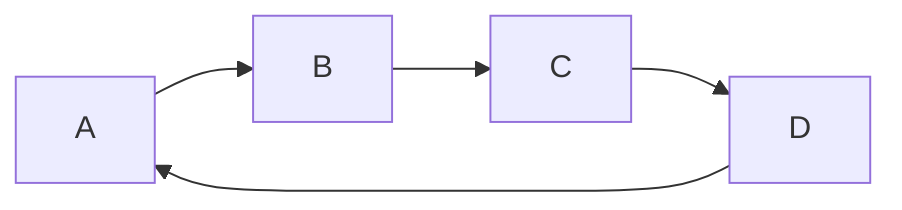
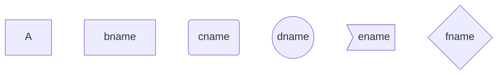
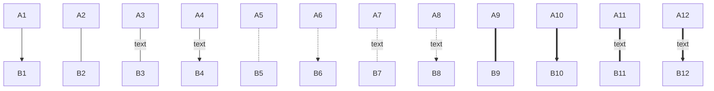
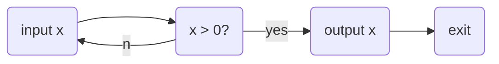
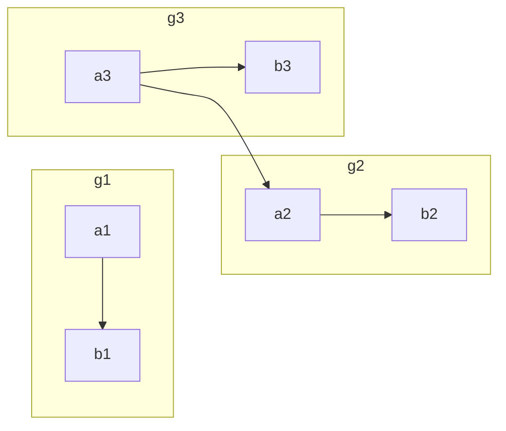
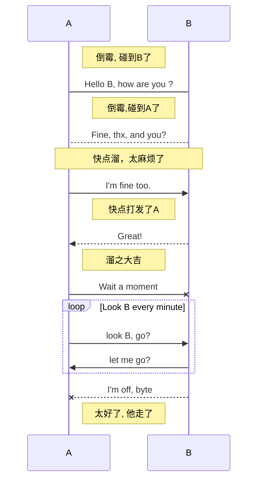
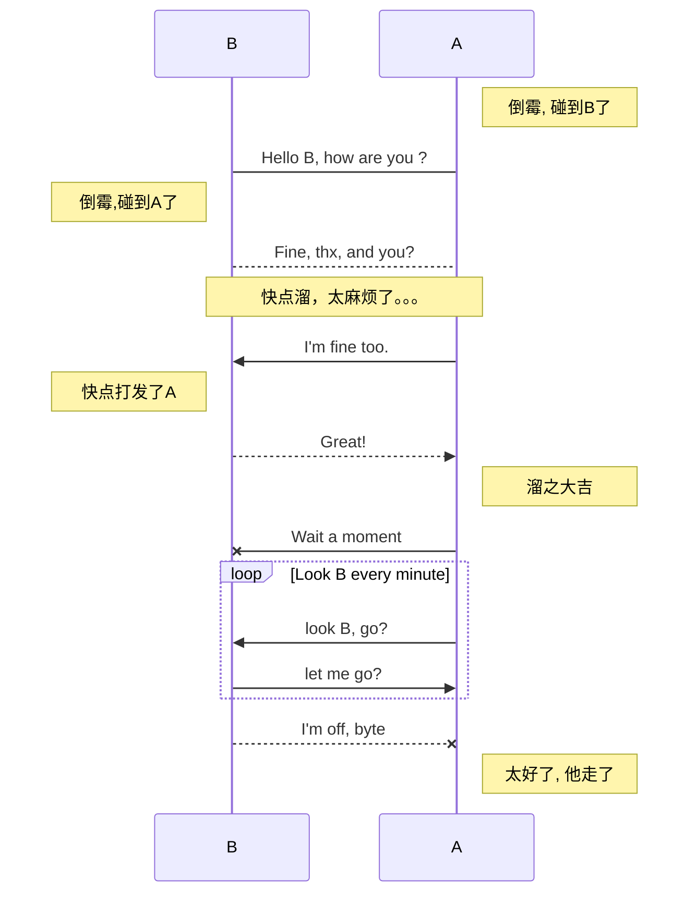
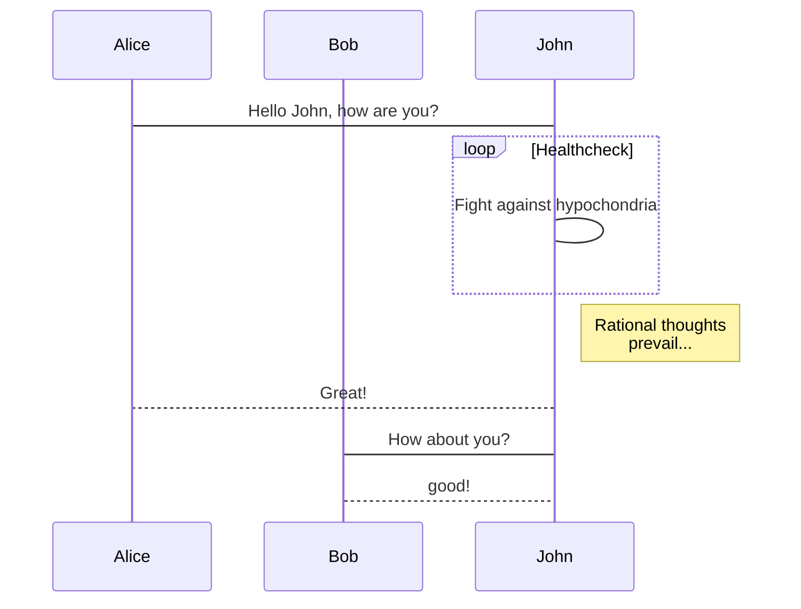
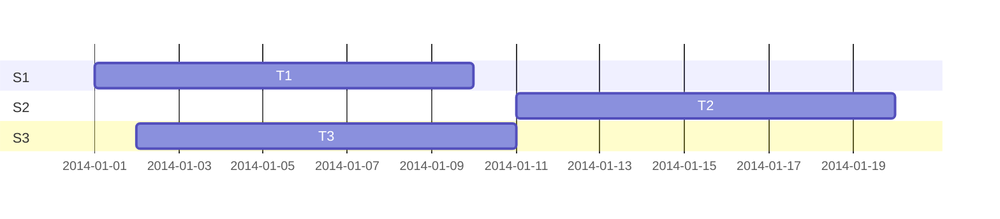
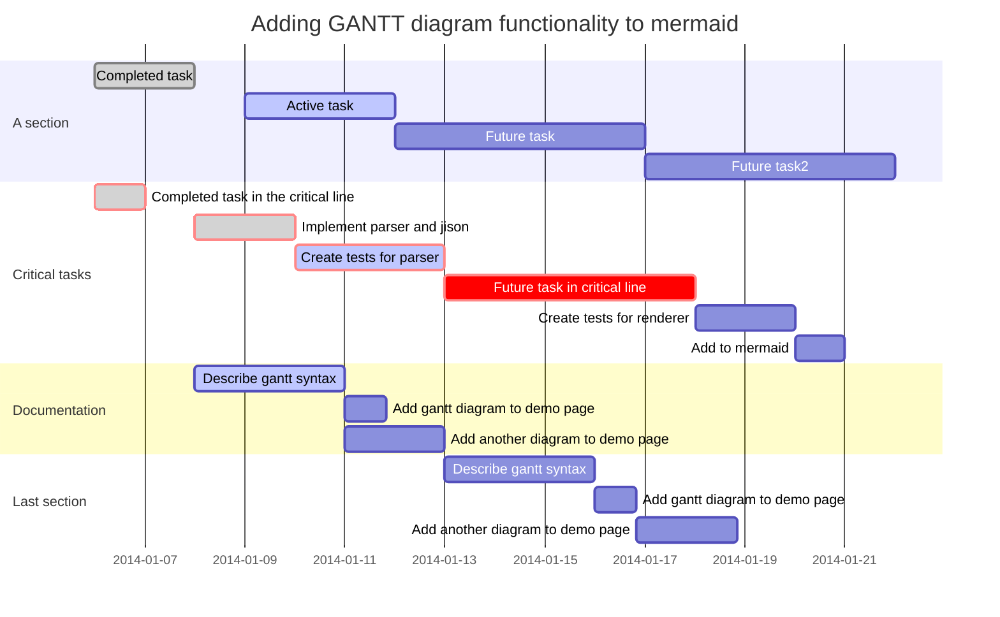

# mermaid

## graph（流程图）

> - **节点名不能与关键字同名**
> - **使用引号可以避免一些不必要的麻烦，如避免与关键字同名**

关键字graph表示一个流程图的开始，同时需要指定该图的方向

**图方向**

- TB，从上到下
- TD，从上到下
- BT，从下到上
- RL，从右到左
- LR，从左到右

> T = TOP，B = BOTTOM，L = LEFT，R = RIGHT，D = DOWN




**节点形状**

- 默认节点 A
- 文本节点 B[bname]
- 圆角节点 C(cname)
- 圆形节点 D((dname))
- 非对称节点 E>ename]
- 菱形节点 F{fname}

> A~F 是当前节点名字，类似于变量名，画图时便于引用
>
> [b~f]name是节点中显示的文字，默认节点的名字和显示的文字都为A




**连线**

节点间的连接线有多种形状，可以在连接线中加入标签：

- 箭头连接 A1–->B1
- 开放连接 A2—B2
- 标签连接 A3–text—B3
- 箭头标签连接 A4–text–>B4
- 虚线开放连接 A5.-B5
- 虚线箭头连接 A6-.->B6
- 标签虚线连接 A7-.text.-B7
- 标签虚线箭头连接 A8-.text.->B8
- 粗线开放连接 A9===B9
- 粗线箭头连接 A10==>B10
- 标签粗线开放连接 A11==text===B11
- 标签粗线箭头连接 A12==text==>B12




example




## subgraph（子图）

格式

```
# 外面的那层, 可以使用子图中的节点，子图中的节点名不是隔离的，可以认为是全局变量-.-
graph LR
  subgraph title1
    graph definition 
  end
  subgraph title2
    graph definition 
  end
  ...
```

如




## sequence diagram （序列图）

**关键字**

- participant，参与者，相当先定义模块，可通过设定参与者(participant)的顺序控制展示顺序

- note， 便签，格式如下

    ```
    note [right of | left of][Actor]:Text
    
    # 给多个模块做标签, 通过逗号分割
    
    note over [Actor1, Actor2...]:Text
    ```

- 循环

    ```
    loop Loop_text
    ... statements...
    end
    ```

- 选择

    ```
    alt Describing_text
    ...statements...
    else
    ...statements...
    end
    
    # 推荐在没有else的情况下使用 opt(option,选择)
    
    opt Describing_text
    ...statements...
    end
    ```

    ```mermaid
    sequenceDiagram
    　　Alice->>Bob: Hello Bob, how are you?
    　　alt is sick
    　　　　Bob->>Alice:not so good :(
    　　else is well
    　　　　Bob->>Alice:good
    　　end
    　　opt Extra response
    　　　　Bob->>Alice:Thanks for asking
    　　end
    ```

    

**连线**

- 无箭头实线 ->
- 有箭头实线 ->>
- 无箭头虚线 –>
- 有箭头虚线 –>>
- 带x实线 -x
- 带x虚线 –x

如




想改变AB的顺序怎么办呢？







## gantt diagram(甘特图)

甘特图是一类条形图，由Karol Adamiechi在1896年提出, 而在1910年Henry Gantt也独立的提出了此种图形表示。通常用在对项目终端元素和总结元素的开始及完成时间进行的描述

关键字如下

| title      | 标题                                                         |
| :--------- | :----------------------------------------------------------- |
| dateFormat | [日期格式](http://momentjs.com/docs/#/parsing/string-format/) |
| section    | 模块                                                         |
| Completed  | 已经完成                                                     |
| Active     | 当前正在进行                                                 |
| Future     | 后续待处理                                                   |
| crit       | 关键阶段                                                     |
| 日期缺失   | 默认从上一项完成后                                           |







# sequence（序列图）

关键字

- title，定义序列图的标题

- participant，定义时序图中的对象

- note，定义对时序图中的部分说明

    方位控制

    1. left of，表示当前对象的左侧
    2. right of，表示当前对象的右侧
    3. over，表示覆盖在当前对象（们）的上面

- {actor}，表示时序图中的具体对象（名称自定义）

- 箭头分为以下几种：

    1. -> 表示实线实箭头
    2. –> 表示虚线实箭头
    3. ->> 表示实线虚箭头
    4. –>> 表示虚线虚箭头

example


```
title: 序列图sequence 示例
# participant, 参与者
participant A
participant B
participant C

note left of A: A左侧说明
note over B: 覆盖B的说明
note right of C: C右侧说明

# - 代表实线, -- 代表虚线; > 代表实箭头, >> 代表虚箭头
A->A:自己到自己
A->B:实线实箭头
A-->C:虚线实箭头
B->>C:实线虚箭头
B-->>A:虚线虚箭头
```

序列图sequence 示例AABBCCA左侧说明覆盖B的说明C右侧说明自己到自己实线实箭头虚线实箭头实线虚箭头虚线虚箭头

定义可以省略如

```
A->B: 吃饭了没？
# 可在文本中使用换行符\n
note right of B: B思考n秒\n如何回答
B--A: 吃过了。你咧？
A->>B: 吃过了，吃过了！
```

AABB吃饭了没？B思考n秒如何回答吃过了。你咧？吃过了，吃过了！

# flow（流程图）

**关键字**

- start/end，表示程序的开始与结束
- operation，表示程序的处理块
- subroutine，表示子程序块
- condition，表示程序的条件判断
- inputoutput，表示程序的出入输出
- right/left，表示当前连线在当前模块上的起点(默认从下端开始)
- yes/no， 表示condition判断的分支(可以和right，left同时使用)

通过定义模块与连接，再结合以上关键词即可定义简单流程图的各个模块。

**模块定义(模块标识与模块名称可以任意定义名称，但是不能为关键词)：**

```
模块标识(相当于变量名)=>模块关键词: 模块名称(模块中显示的文字)
```

**连接定义如下:**

```
模块标识1->模块标识2
模块标识1->模块标识2->模块标识3
...
```

**进行连接的时候，可以通过right，left确定箭头的起点。**

**使用condition关键词定义的判断框的连接需要结合yes或者no使用**，如

```flow
cond1=>condition: x>0?
cond1(yes)->module1
cond1(no)->moudle2

# 指定方向,如果后面占用了这个方向, 前面的无效   
cond1(yes,right)->module1
cond1(no)->moudle2
# 先自定义变量,然后画图
st=>start: 开始
e=>end: 结束
op=>operation: 输入x
sub=>subroutine: 是否重新输入
cond1=>condition: x>0?
cond2=>condition: yes/no 
io=>inputoutput: 输出x  

st(right)->op->cond1
cond1(yes)->io(right)->e
cond1(no)->sub(right)->cond2()
cond2(yes, right)->op
cond2(no)->e
```

开始输入xx>0?输出x结束是否重新输入y